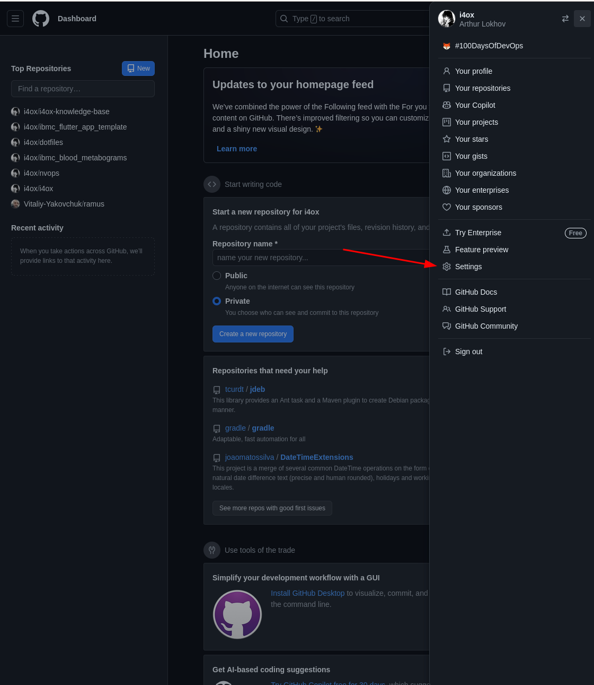
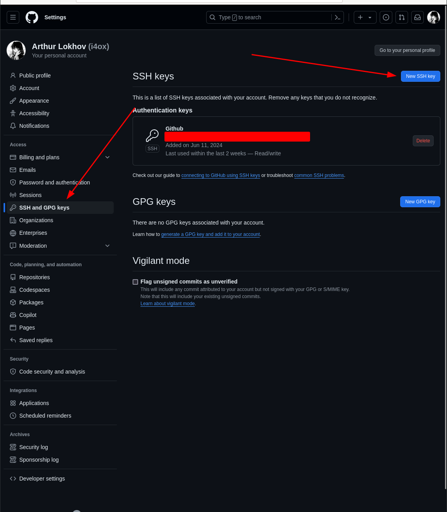
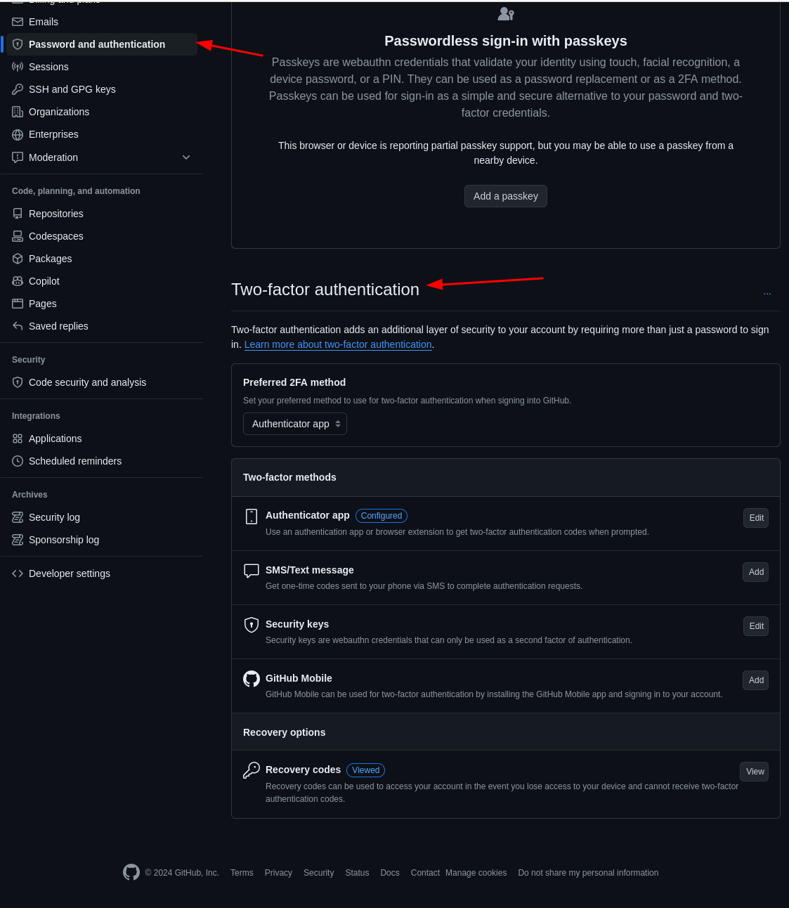

# GitHub

**GitHub** - крупнейшее хранилище Git репозиториев, а так же центр сотрудничества для миллионов разработчиков и проектов.

## Из важного

- У GitHub своя версия Markdown - [GitHub Flavored Markdown](https://github.com/sindresorhus/github-markdown-css)
- GitHub позволяет использовать смайлики, они начанаются с :
- У GitHub есть своя CLI утилита - [gh](https://cli.github.com/)
- У GitHub есть api, расположенные по [ccылке](https://api.github.com/)

## Настройка и конфигурация учетной записи

Ниже перечислены шаги, которые рекомендуется сделать.

### Подключение по SSH

### Почтовые адреса

### Двухфакторная аутентификация

**Двухфакторная аутентификация** - механизм, который становится все более и более популярным методом по снижению риска скомпрометировать вашу учетную запись.

## Рабочий процесс с использованием GitHub

1. Создайте форк проекта
2. Создайте тематическую ветку на основании ветки *master*.
3. Создайте одну иои несколько коммитов с изменениями, улучшающими проект.
4. Отправьте ветку в ваш проект на GitHub.
5. Откройте запрос на слияние на GitHub.
6. Обсуждайте его, вносите изменения, если нужно.
7. Владелец проекта принимает решение о принятии изменений, либо об их отколнении.
8. Получите обновленную ветку *master* и отправьте ее в свой форк.

## Особенные файлы

- *README.md*: если GitHub увидит такой файл, то отобразит его на заглавной странице проекта;
- *CONTRIBUTING*: если GitHub увидит такой файл, то каждый раз при создании PR он будет указывать ссылку на этот файл;

