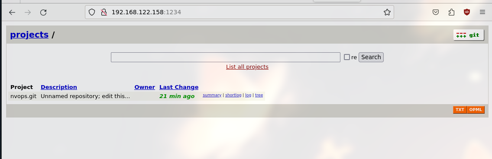
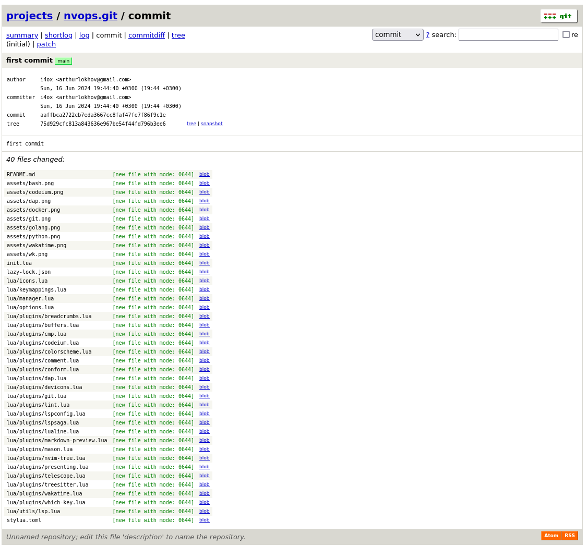

<!-- # Настройка Git сервера с нуля на Debian 12 -->

В этом руководстве мы рассмотрим, как настроить собственный Git сервер на базе Debian 12.
Мы пройдем через установку и настройку необходимых компонентов, включая:

- SSH;
- создание пользователей;
- инициализация проектов;
- настройка веб-интерфейса для просмотра репозиториев.

**Цель**: создать гибкую и безопасную систему управления версиями без использования сторонних сервисов.

## Настройка SSH на сервере

Первым шагом является установка и настройка SSH сервера, который обеспечит безопасный доступ к нашему серверу.

### Установка openssh-server

Для установка `openssh-server` выполните следующие команды:

```bash
apt update
apt install openssh-server
```

### Настройка openssh-server

Для начала надо открыть файл конфигурации SSH:

```bash
nano /etc/ssh/sshd_config
```

Измените следующие параметры для повышения безопасности:

- *Port*: измените стандартный порт на другой для уменьшения числа автоматических атак;
- *PermitRootLogin*: отключите вход по пользователю root после настройки отдельного пользователя для работы с сервером;
- *PasswordAuthentification*: отключите вход по паролю после настройки ключей;
- *PermitEmptyPasswords*: отключите пустые пароли(можно проигнорировать, если стоит `PasswordAuthentification: no`);
- *PubkeyAuthentification*: включите аутентификацию по ключам.

После внесения изменений перезапустите SSH службу:

```bash
systemctl restart sshd
```

## Создание пользователя *admin*

Для управления сервером создайте пользователя `admin` с правами `sudo`:

```bash
adduser admin
apt install sudo
usermod -aG sudo admin
su admin
cd
mkdir .ssh
chmod 700 .ssh
touch .ssh/authorized_keys
chmod 600 .ssh/authorized_keys # Добавить ключ системного_администратора
```

После незабудьте установить с конфигурации SSH `PermitRootLogin no` и отключите доступ к пользователю *root*:

```bash
sudo nano /etc/passwd
# Меняем root:x:0:0:root:/root:/bin/bash на root:x:0:0:root:/root:/sbin/nologin
```

Если попробовать зайти в *root*, то выведется следующие сообщение: ***This account is currently not available.***

## Создание пользователя *git*

Для работы с Git создадим отдельного пользователя *git*:

```bash
adduser git
su git
cd 
mkdir .ssh
chmod 700 .ssh
touch .ssh/authorized_keys
chmod 600 .ssh/authorized_keys
```

## Генерация ключа на клиенте

Создайте SSH ключ на клиенте:

```bash
ssh-keygen -t ed25519 -f ~/.ssh/key_for_git -C "Developer name"
ssh-keygen -t ed25519 -f ~/.ssh/key_for_admin -C "Developer name"
```

Настройте клиент SSH для работы с новым ключом:

```gitconfig
Host server_git
  HostName <hostname>
  StrictHostKeyChecking no
  User git
  Port <port>
  ForwardAgent yes
  IdentityFile /home/i4ox/.ssh/key_for_git
  IdentitiesOnly yes
  UserKnownHostsFile=/dev/null
  AddKeysToAgent yes
  ServerAliveInterval 60
  ServerAliveCountMax 1200

Host server_admin
  HostName <hostname>
  StrictHostKeyChecking no
  User admin
  Port <port>
  ForwardAgent yes
  IdentityFile /home/i4ox/.ssh/key_for_admin
  IdentitiesOnly yes
  UserKnownHostsFile=/dev/null
  AddKeysToAgent yes
  ServerAliveInterval 60
  ServerAliveCountMax 1200
```

Добавьте публичный ключ `server_git` в `/home/git/.ssh/authorized_keys`, также и для `server_admin`, но в `/home/admin/.ssh/authorized_keys`.
Отключите вход по паролю в SSH, если соединение через SSH проходит успешно.

## Инициализация проекта

После настройки пользователей и SSH, следующий шаг - это инициализация проекта на сервере.
В этом разделе рассмотрим как создать "голый" репозиторий, сделать первый коммит и настроить удаленный репозиторий для работы.


### Создание "голого" репозитория

"Голый" репозиторий(*--bare*) используется на сервере, чтобы хранить центральное хранилище кода.
Он не содержит рабочей копии файлов и предназначем исключительно для обмена данными между разработчиками.

**P.S**: подразумевается, что все команды выполняются от пользователя *admin*.

1. Установите Git, если он еще не установлен:

```bash
sudo apt install git
```

2. Создайте директорию для хранения репозиториев и настройте права доступа:

```bash
sudo mkdir -p /srv/git
sudo chown git:git /srv/git/
```

3. Создайте "голый" репозиторий:

```bash
sudo -u git -i
cd /srv/git
mkdir my_project.git
cd my_project.git
git init --bare
exit
```

### Настройка локального репозитория и первый коммит

Теперь настроим локальный репозиторий, сделаем первый коммит и отправим его на сервер.

1. На вашей локальной машине инициализируйте новый репозиторий:

```bash
mkdir my_project
cd my_project
git init
echo "# My Project" > README.md
git add README.md
git commit -m "Initial commit"
git remote add origin git@hostname:/srv/git/my_project.git
git push -u origin main
```

## Настройка демона Git

Git-демон позволяет предоставлять доступ к репозиториям через протокол `git://`, что обеспечивает быструю и легкую настройку для чтения.

### Создание службы для systemd.

1. Создайте файл службы для Git-демона:

```bash
sudo nano /etc/systemd/system/git-daemon.service
```

2. Вставьте следующее содержимое:

```ini
[Unit]
Description=Git daemon

[Service]
ExecStart=/usr/bin/git daemon --reuseaddr --export-all --base-path=/srv/git/ /srv/git/
Restart=always
RestartSec=500ms

StandardOutput=syslog
StandardError=syslog
SyslogIdentifier=git-daemon

User=git
Group=git

[Install]
WantedBy=multi-user.target
```

3. Запустите и активируйте службу.

```bash
systemctl enable git-daemon
systemctl start git-daemon
systemctl status git-daemon
```

## Настройка GitWeb

GitWeb предоставляет веб-интерфейс для просмотра репозиториев Git. Рассмотрим два способы настройки:

- с использованием встроенного в Git *git instaweb*;
- через веб-сервер `nginx`.

### Использование git instaweb

*git instaweb* позволяет быстро развернуть веб-интерфейс для каждого репозитория.

1. Установите **lighttpd**, если он еще не установлен:

```bash
sudo apt install lighttpd
```

2. Перейдите в директорию проекта и запустите *git instaweb*:

```bash
cd /srv/git/my_project.git
git instaweb
```

3. Откройте браузер и перейдите по адресу ***http://hostname:1234***, чтобы увидеть интерфейс GitWeb:



4. Остановите сервер:

```bash
git instaweb --stop
```

### Настройка GitWeb через Nginx

1. Установите необходимые пакеты:

```bash
apt install nginx gitweb fcgiwrap
```

2. Настройте nginx для работы с GitWeb. Создайте конфигурационный файл для сайта:

```bash
sudo nano /etc/nginx/sites-available/gitweb
```

3. Вставьте следующее содержимое:

```conf
server {
    listen 80;
    server_name example.com;

    location /index.cgi {
        root /usr/share/gitweb/;
        include fastcgi_params;
        gzip off;
        fastcgi_param SCRIPT_NAME $uri;
        fastcgi_param GITWEB_CONFIG /etc/gitweb.conf;
        fastcgi_pass unix:/var/run/fcgiwrap.socket;
    }

    location / {
        root /usr/share/gitweb/;
        index index.cgi;
    }
}
```

4. Активируйте конфигурацию:

```bash
sudo ln -s /etc/nginx/sites-available/gitweb /etc/nginx/sites-enabled/gitweb
sudo rm /etc/nginx/sites-enabled/default
sudo systemctl restart nginx
```

5. Откройте браузер и перейдите по адресу вашего сервера, чтобы увидеть интерфейс GitWeb:


6. Обновите конфигурацию GitWeb для правильного отображения проектов. Откройте файл конфигурации:

```bash
sudo nano /etc/gitweb.conf
```

7. Измените путь к проектам:

```perl
our $projectroot = '/srv/git';
```

Теперь наш Git сервер настроен, и у нас есть доступ к репозиториям через SSH, Git-демон и веб-интерфейс GitWeb.
Это конфигурация обеспечивает как безопасность, так и удобство использования, а также поддержку анонимного и аутентифицированного доступа к репозиториям.




## Дополнительные аспекты безопасности и оптимизации

### Защита от brute-force атак

Для дополнительной защиты вашего сервера можно установить и настроить такие инструменты, как *fail2ban*,
которые будут блокировать IP-адреса, совершившие слишком много неудачных попытов входа.

```bash
sudo apt install fail2ban
```

Настройте *fail2ban* для защиты SSH:

```bash
nano /etc/fail2ban/jail.local
```

Добавьте следующие строки:

```ini
[sshd]
enabled = true
port = ssh
logpath = /var/log/auth.log
maxretry = 5
```

Создаем файл, необходимый для логов, если не создан, и перезапусаем *fail2ban*:

```bash
sudo touch /var/log/auth.log
systemctl restart fail2ban
systemctl status fail2ban
```

### Настройка брандмауэра

Для ограничения доступа к нашему серверу настроим брандмауэр, например, *ufw*:

```bash
sudo apt install ufw
sudo ufw allow 443/tcp # У меня тут работает SSH
sudo ufw allow 80/tcp
```

Командами выше мы установили *ufw* и разрешили запросы к портам 443(у меня тут ssh, вместо 20) и 80(nginx).

Теперь включим *ufw*:

```bash
sudo ufw enable
```

### Автоматическое обновление пакетов

Для обеспечения безопасности системы рекомендуется настроить автоматическое обновление пакетов.
Установите пакет *unattended-upgrades*:

```bash
sudo apt install unattended-upgrades
sudo dpkg-reconfigure --priority=low unattended-upgrades
```

### Создание резервных копий

Для предотвращения потери данных важно настроить регулярное создание резервных копий.
Вы можете использовать *rsync* или специализированные инструменты для создания резервных копий репозиториев и конфигураций сервера.

1. Установите *rsync*:

```bash
sudo apt install rsync
```

2. Настройте *cron* для автоматизации резервного копирования:

```bash
crontab -e
```

3. Добавьте следующее задание, чтобы оно выполнялось ежедневно в 2 часа ночи:

```bash
0 2 * * * rsync -avz /srv/git/ /srv/git-backup/
```

## Итог

В этом руководстве мы рассмотрели, как настроить собственный Git сервер на базе Debian 12,
обеспечив при этом высокий уровень безопасности и функциональности.
Мы прошли через установку и настройку SSH, создание пользователей, инициализацию проектов,
настройку веб-интерфейса и рассмотрели дополнительные аспекты безопасности, такие как защита от brute-force атак,
настройка брандмаэура и автоматического обновления пакетов.
Также мы настроили резервное копирование данных.
Этот сервер может послужить надежной опорой для управления вашими проектами и разработки програмнного обеспечения.

### Как можно улучшить Git сервер?

1. Делать резервное копирование не в другую директорию, а на другой сервер.
2. Настроить мониторинг через Prometheus и Grafana.
3. Настроить CI/CD пайплайн для работы с нашими репозиториями(maybe Jenkins).

