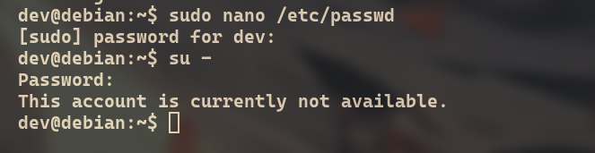
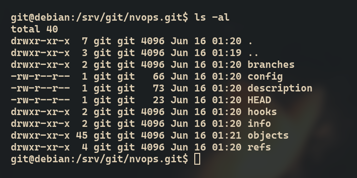
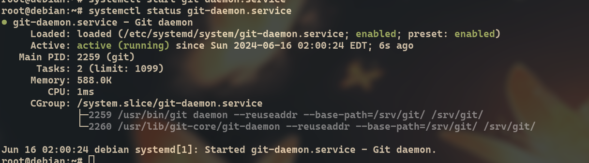
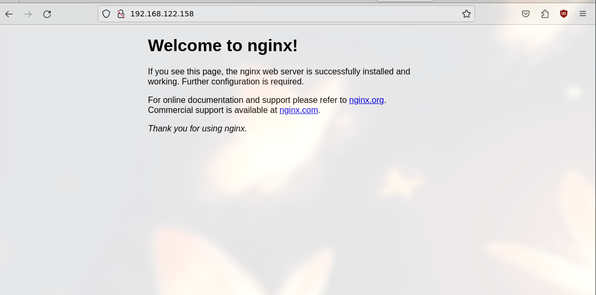

**P.S**: в качестве сервера используется *Debian 12*.

### Настройка SSH на сервере

1. Установка `openssh-server`.

```bash
apt update
apt install openssh-server
```

2. Настройка `/etc/ssh/sshd_config`.

Нужно настроить следующие параметры:

- Port: поменять его с дефолтного
- PermitRootLogin: отключить(после создания `dev` пользователя)
- PasswordAuthentification: отключить(после добавления ключей)
- PermitEmptyPasswords: отключить
- PubkeyAuthentification: включить

3. Перезапускаем службу

```bash
systemctl restart sshd
```

### Пользователь dev

Пользователь с доступом к рут-правам через `sudo`. Нужен для подключения к серверу, чтобы его можно было настраивать, потому что `root` закрыт, а `git` использует `git-shell`.

```bash
adduser dev
apt install sudo
usermod -aG sudo dev
su dev
mkdir .ssh
chmod 700 .ssh
touch .ssh/authorized_keys
chmod 600 .ssh/authorized_keys # Добавить ключ системного_администратора
```

Так как теперь у нас есть пользователь для взаимодействия с системой, то мы может отключить `root`.

```bash
sudo nano /etc/passwd
# Меняем root:x:0:0:root:/root:/bin/bash на root:x:0:0:root:/root:/sbin/nologin
```



### Пользователь git

Для работы с git на нашем сервере, создадим отдельного пользователя:

1. Создадим нового пользователя git

```bash
adduser git
su git
```

2. Настроим SSH для нового пользователя

```bash
cd 
mkdir .ssh
chmod 700 .ssh
touch .ssh/authorized_keys
chmod 600 .ssh/authorized_keys
```

3. Создаем публичный ключ на клиенте и прописываем в `.ssh/authorized_keys`.

При необходимости можно настроить клиент ssh:

```config
Host 192.168.122.208
  StrictHostKeyChecking no
  User git
  Port 443
  ForwardAgent yes
  IdentityFile /home/i4ox/.ssh/git_server
  IdentitiesOnly yes
  UserKnownHostsFile=/dev/null
  AddKeysToAgent yes
  ServerAliveInterval 60
  ServerAliveCountMax 1200
```

### Инициализация проекта

1. Инициализируем "голый" проект на сервере

```bash
su -
apt install git
mkdir /srv/git
chown git:git /srv/git/
su git
cd /srv/git
mkdir <project_name>.git
cd <project_name>.git
git init --bare
```



2. Сделаем первый коммит

```bash
git init
git add --all
git commit -m "initial commit"
git remote add origin git@192.168.122.208:/srv/git/<project_name>.git
git push origin main
```

### Ограничение доступа

1. Включение git-shell.

`git-shell` - это специальная командная оболочка, где есть только команды git и ничего более.

```bash
nano /etc/shells # Добавить git-shell.
mkdir /home/git/git-shell-commands
chsh -s $(command -v git-shell) git
```

В этой оболочке не будет абсолютно никаких комманд. Для того, чтобы они появились(если они нужны) надо создавать bash-сценарии в каталоге `git-shell-commands`.

2. Отключаем всю возможную переадресацию по SSH.

Для этого добавляем `no-port-forwarding,no-X11-forwarding,no-agent-forwarding,no-pty` ко всем ключам в `.ssh/authorized_keys`

### Настройка демона Git

1. Создание службы для systemd.

```toml
# /etc/systemd/system/git-daemon.service
[Unit]
Description=Git daemon

[Service]
ExecStart=/usr/bin/git daemon --reuseaddr --export-all --base-path=/srv/git/ /srv/git/
Restart=always
RestartSec=500ms

StandardOutput=syslog
StandardError=syslog
SyslogIdentifier=git-daemon

User=git
Group=git

[Install]
WantedBy=multi-user.target
```

2. Запуск службы.

```bash
systemctl enable git-daemon
systemctl start git-daemon
systemctl status git-daemon
```



Итого у нас имеется:

- безопасная аутентификация через SSH;
- анонимный, неаутентифицированный доступ через `git://` для просмотра файлов.

### Настройка сервера и установка GitWeb

1. Использовать `git instaweb`, но тогда в каждом проекте придется запускать собственный экземпляр данной команды.
2. Через отдельно настроенный `gitweb`.

#### Первый вариант

**P.S**: `gitweb` постовляется как отдельно, так и вмесете с `git`. Команда `git instaweb` использует, установленный вместе с самим `git` экземпляр

```bash
apt install lighttpd
cd /srv/git/<project>.git
git instaweb # Сделать для всех нужных проектов
git instaweb --stop # Чтобы остановить веб-сервер
```


#### Второй способ

Для начала надо поставить все необходимые инструменты:

```bash
apt install nginx gitweb fcgiwrap
```

Теперь мы можем открыть наш сервер и мы увидем следующее:




Далее выполняем следующее:

```bash
cd /etc/nginx/sites-enabled
rm default
touch gitweb
```

Только что созданный файл будет иметь следующее содержимое:

```conf
server {
    listen 80;
    #replace "example.com" below with your domain (or subdomain)
    server_name example.com;

    location /index.cgi {
      root /usr/share/gitweb/;
      include fastcgi_params;
      gzip off;
      fastcgi_param SCRIPT_NAME $uri;
      fastcgi_param GITWEB_CONFIG /etc/gitweb.conf;
      fastcgi_pass  unix:/var/run/fcgiwrap.socket;
    }

    location / {
      root /usr/share/gitweb/;
      index index.cgi;
    }

}
```

После перезапускаем `nginx` и мы сможем увидеть следующее:


Но nginx не видет проекты, исправим это. Для этого нам надо отредактировать конфигурацию `gitweb.conf`.

```bash
nano /etc/gitweb.conf
# $projectroot = '/srv/git'; вместо /var/lib/git
```

В конце мы увидем необходимый результат.


### Дополнительная кастомизация GitWeb

GitWeb имеет возможность использовать кастомные стили и скрипты JS.

Для этого в `/etc/gitweb.conf` используются строки: *@stylesheets* и *$javascript*.

### Итоги

В ходе данной практики я разобрал как настроить с нуля свой собственный git сервер без посредников, таких как GitLab или Gitea.
